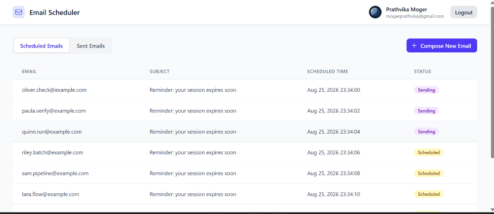
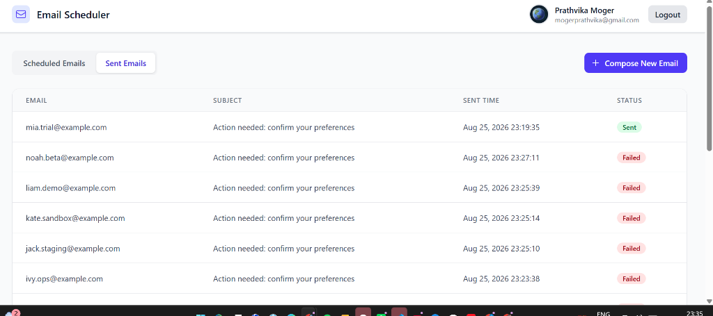

# 📧 Email Job Scheduler — Full-Stack MERN Application

A production-grade email scheduling service with a React dashboard, built on the MERN stack with BullMQ for reliable job scheduling.

### 🔗 [Live Demo](https://full-stack-email-scheduler-flax.vercel.app) | [Backend API](https://email-scheduler-api-59kd.onrender.com/api/health)

     

---

## 📸 Screenshots

### Scheduled Emails Dashboard


### Sent Emails Tracking


---

## 🌐 Live Demo

| Service | URL |
|---|---|
| **Frontend (Vercel)** | [full-stack-email-scheduler-flax.vercel.app](https://full-stack-email-scheduler-flax.vercel.app) |
| **Backend API (Render)** | [email-scheduler-api-59kd.onrender.com](https://email-scheduler-api-59kd.onrender.com) |
| **Database** | MongoDB Atlas (Free M0) |
| **Redis** | Upstash (Serverless Redis) |

> **Note:** The Render free tier may take ~30 seconds to wake up on first request. Subsequent requests are fast.

---

## Table of Contents

- [Features](#features)
- [Architecture Overview](#architecture-overview)
- [Tech Stack](#tech-stack)
- [Prerequisites](#prerequisites)
- [Quick Start (Local Development)](#quick-start-local-development)
- [Environment Variables](#environment-variables)
- [Deployment](#deployment)
- [Architecture Deep-Dive](#architecture-deep-dive)
- [Project Structure](#project-structure)
- [API Reference](#api-reference)
- [Assumptions & Trade-offs](#assumptions--trade-offs)

---

## ✨ Features

### Backend — Scheduler, Persistence, Rate Limiting, Concurrency

| Feature | Details |
|---|---|
| ✅ REST API for email scheduling | POST with CSV upload, GET for scheduled/sent |
| ✅ BullMQ delayed jobs | Scheduling only via BullMQ — no cron jobs |
| ✅ MongoDB persistence | All jobs stored with full status lifecycle |
| ✅ Restart persistence | BullMQ delayed jobs survive Redis restarts (ZSET) |
| ✅ Idempotency (no duplicate sends) | 3-layer: BullMQ jobId + MongoDB unique index + worker status check |
| ✅ Redis-backed rate limiting | Lua-scripted atomic counters per hour window |
| ✅ Per-sender hourly limit | Configurable via `MAX_EMAILS_PER_HOUR_PER_SENDER` |
| ✅ Global hourly limit | Configurable via `MAX_EMAILS_PER_HOUR` |
| ✅ Minimum delay between sends | BullMQ worker-level `limiter` (configurable) |
| ✅ Configurable worker concurrency | `WORKER_CONCURRENCY` env var |
| ✅ Rate-limited job rescheduling | `moveToDelayed()` + `DelayedError` — jobs delayed, never dropped |
| ✅ Multiple sender accounts | Round-robin assignment, independent rate limits |
| ✅ Auto Ethereal account creation | Creates test SMTP account if none configured |
| ✅ Smart SMTP fallback | Auto-detects if SMTP is blocked, switches to demo mode |
| ✅ Graceful shutdown | SIGTERM/SIGINT handlers close workers cleanly |
| ✅ Bulk scheduling (1000+) | Bulk MongoDB writes + BullMQ `addBulk()` |

### Frontend — Login, Dashboard, Compose, Tables

| Feature | Details |
|---|---|
| ✅ Google OAuth login | Real Google Sign-In via `@react-oauth/google` |
| ✅ JWT session management | Stored in localStorage, auto-validated on mount |
| ✅ Protected routes | Dashboard requires authentication |
| ✅ Compose modal | Subject, body, CSV upload, scheduling params |
| ✅ CSV file upload | Drag-and-drop, email count preview, deduplication |
| ✅ Scheduled emails table | Paginated, auto-refreshing (10s), loading/empty states |
| ✅ Sent emails table | Paginated, auto-refreshing, status badges |
| ✅ Reusable UI components | Button, Input, Modal, Table, Badge, FileUpload |
| ✅ Toast notifications | Success/error feedback via react-hot-toast |
| ✅ Responsive design | Tailwind CSS responsive utilities |

---

## 🏗 Architecture Overview

```
┌─────────────────────────────────────────────────────────┐
│                  Frontend (React + Vite)                  │
│       Vercel: full-stack-email-scheduler-flax.vercel.app │
│  Login → Dashboard → Compose → Schedule → View Status   │
└────────────────────────┬────────────────────────────────┘
                         │ HTTP (REST API via Vercel Rewrites)
┌────────────────────────▼────────────────────────────────┐
│              Backend (Express.js + BullMQ)                │
│        Render: email-scheduler-api-59kd.onrender.com     │
│                                                          │
│  ┌──────────┐  ┌────────────────┐  ┌─────────────────┐  │
│  │ Auth API │  │ Scheduling API │  │ Email Service    │  │
│  │ (Google) │  │ (CSV → Jobs)   │  │ (Nodemailer)     │  │
│  └──────────┘  └───────┬────────┘  └────────▲────────┘  │
│                        │                     │           │
│  ┌─────────────────────▼─────────────────────┤           │
│  │           BullMQ Queue + Worker           │           │
│  │  • Delayed jobs (Redis ZSET)              │           │
│  │  • Rate limiter (Redis Lua INCR)          │           │
│  │  • Idempotency check (MongoDB)            │           │
│  └─────────────┬─────────────────────────────┘           │
└────────────────┼─────────────────────────────────────────┘
                 │
    ┌────────────▼────────────┐    ┌──────────────────┐
    │   Upstash Redis (Cloud) │    │ MongoDB Atlas     │
    │  • Job queue storage    │    │  • EmailJob docs  │
    │  • Rate limit counters  │    │  • User docs      │
    │  • Delayed job ZSET     │    │  (Free M0 Tier)   │
    └─────────────────────────┘    └──────────────────┘
```

---

## 🛠 Tech Stack

| Layer | Technology |
|---|---|
| **Frontend** | React 18, Tailwind CSS v4, Vite, React Router |
| **Backend** | Node.js, Express.js, BullMQ, Nodemailer |
| **Database** | MongoDB (Mongoose ODM) |
| **Queue/Cache** | Redis (BullMQ + Rate Limiting) |
| **Auth** | Google OAuth 2.0, JWT |
| **Deployment** | Vercel (frontend), Render (backend), MongoDB Atlas, Upstash Redis |

---

## 📋 Prerequisites

- **Node.js** 18+ and npm
- **Docker** and Docker Compose (for local Redis + MongoDB) OR install them locally
- **Google Cloud Console** project with OAuth 2.0 credentials

---

## 🚀 Quick Start (Local Development)

### 1. Clone and Install

```bash
git clone https://github.com/Prathvikakrishnamoger/full-stack-email-scheduler.git
cd full-stack-email-scheduler

# Install backend dependencies
cd backend && npm install

# Install frontend dependencies
cd ../frontend && npm install
```

### 2. Start Infrastructure (Redis + MongoDB)

```bash
# From project root
docker-compose up -d
```

This starts:
- Redis 7 on `localhost:6379` (with AOF persistence)
- MongoDB 7 on `localhost:27017`

### 3. Configure Environment

```bash
# Backend
cp backend/.env.example backend/.env
# Edit backend/.env — add your GOOGLE_CLIENT_ID

# Frontend
cp frontend/.env.example frontend/.env
# Edit frontend/.env — add your VITE_GOOGLE_CLIENT_ID
```

### 4. Start Backend

```bash
cd backend
npm run dev
# Server runs on http://localhost:5000
```

### 5. Start Frontend

```bash
cd frontend
npm run dev
# Dashboard runs on http://localhost:3000
```

### 6. Use the App

1. Open `http://localhost:3000`
2. Sign in with Google
3. Click **"Compose New Email"**
4. Upload a CSV of email addresses, set subject/body/schedule time
5. Watch emails appear in the Scheduled table, then move to Sent

---

## ⚙️ Environment Variables

### Backend (`backend/.env`)

| Variable | Default | Description |
|---|---|---|
| `PORT` | `5000` | Express server port |
| `MONGO_URI` | `mongodb://localhost:27017/email-scheduler` | MongoDB connection string |
| `REDIS_URL` | `redis://localhost:6379` | Redis connection URL |
| `JWT_SECRET` | `dev-secret-change-me` | Secret for signing JWTs |
| `GOOGLE_CLIENT_ID` | — | Google OAuth Client ID (**required**) |
| `WORKER_CONCURRENCY` | `5` | Parallel email send jobs per worker |
| `MAX_EMAILS_PER_HOUR` | `500` | Global hourly email limit |
| `MAX_EMAILS_PER_HOUR_PER_SENDER` | `100` | Per-sender hourly email limit |
| `MIN_DELAY_BETWEEN_SENDS_MS` | `2000` | Minimum ms between consecutive sends |
| `SENDER_ACCOUNTS` | `[]` | JSON array of Ethereal accounts |

### Frontend (`frontend/.env`)

| Variable | Description |
|---|---|
| `VITE_GOOGLE_CLIENT_ID` | Google OAuth Client ID (**required**) |
| `VITE_API_URL` | Backend URL (only needed in production) |

---

## 🌍 Deployment

The app is deployed across 4 free services:

| Service | Provider | Purpose |
|---|---|---|
| Frontend | [Vercel](https://vercel.com) | Static site hosting + API rewrites |
| Backend | [Render](https://render.com) | Node.js web service |
| Database | [MongoDB Atlas](https://mongodb.com/atlas) | Free M0 cluster |
| Redis | [Upstash](https://upstash.com) | Serverless Redis |

### Google OAuth Setup

1. Go to [Google Cloud Console → Credentials](https://console.cloud.google.com/apis/credentials)
2. Create an **OAuth 2.0 Client ID** (Web application)
3. Add **Authorized JavaScript origins**:
   - `http://localhost:3000` (local dev)
   - `https://full-stack-email-scheduler-flax.vercel.app` (production)
4. Set the Client ID in both backend and frontend `.env` files

---

## 🔬 Architecture Deep-Dive

### How Scheduling Works

1. User uploads a CSV of email addresses through the dashboard
2. Backend parses the CSV, validates emails, and computes scheduled times:
   - `scheduledAt[i] = startTime + (i × delayBetweenEmails)`
3. For each email, the backend:
   - Creates an `EmailJob` document in MongoDB with a **deterministic `jobId`** (`batch-{uuid}-{index}`)
   - Enqueues a BullMQ delayed job with `delay = scheduledAt - now`
4. BullMQ uses `Queue.addBulk()` for efficient batch insertion

### How Restart Persistence Works

**BullMQ delayed jobs are stored in Redis sorted sets (ZSETs).** The score is the Unix timestamp when the job should run.

- When the server restarts, the BullMQ worker reconnects to Redis
- Redis has AOF persistence, so the ZSET survives restarts
- Any job with `score <= Date.now()` is immediately promoted and processed
- **No re-enqueue logic needed** — built into BullMQ's architecture

### How Idempotency Works (No Duplicate Sends)

Three layers of protection:

1. **BullMQ `jobId` deduplication** — adding a job with an existing ID is silently ignored
2. **MongoDB unique index on `jobId`** — duplicate inserts throw `E11000`
3. **Worker-side status check** — `if (emailJob.status === 'sent') return`

### How Rate Limiting Works

**Layer 1: Minimum Delay Between Sends**
```js
// BullMQ Worker limiter — at most 1 job per MIN_DELAY_BETWEEN_SENDS_MS
limiter: { max: 1, duration: MIN_DELAY_BETWEEN_SENDS_MS }
```

**Layer 2: Hourly Rate Limits (Lua-scripted)**
- Redis counters keyed by `rate:sender:{email}:{hourWindow}` and `rate:global:{hourWindow}`
- Atomic Lua script: `GET` + `INCR` + `EXPIRE` in a single Redis call
- On rate limit hit: `job.moveToDelayed(nextHourTimestamp)` + `DelayedError`
  - Job goes back to delayed set, **not failed**, preserves order

### Handling 1000+ Concurrent Emails

1. **Staggered scheduling** — jobs spread with configurable delays
2. **BullMQ limiter** — only 1 job per 2s processed (configurable)
3. **Redis counters** — once hourly limit hit, remaining jobs auto-delayed to next hour
4. **Order preservation** — delayed timestamps increase monotonically

---

## 📁 Project Structure

```
full_stack_email_scheduler/
├── docker-compose.yml              # Redis + MongoDB containers
├── render.yaml                     # Render deployment blueprint
├── README.md
├── docs/screenshots/               # App screenshots
├── backend/
│   ├── package.json
│   ├── .env.example
│   └── src/
│       ├── index.js                # Express entry point + worker
│       ├── config/
│       │   ├── env.js              # Centralized env loader
│       │   ├── db.js               # MongoDB connection
│       │   └── redis.js            # Redis/ioredis connections
│       ├── models/
│       │   ├── User.js             # Google user model
│       │   └── EmailJob.js         # Email job model
│       ├── middleware/
│       │   └── auth.js             # JWT authentication
│       ├── services/
│       │   ├── emailService.js     # Nodemailer + SMTP + demo fallback
│       │   ├── rateLimiterService.js  # Redis Lua rate limiting
│       │   └── schedulerService.js # Batch scheduling logic
│       ├── queue/
│       │   ├── emailQueue.js       # BullMQ Queue
│       │   └── emailWorker.js      # BullMQ Worker
│       └── routes/
│           ├── auth.js             # Google OAuth endpoints
│           └── emails.js           # Email CRUD + scheduling
└── frontend/
    ├── package.json
    ├── vite.config.js
    ├── vercel.json                 # Vercel deployment config
    ├── index.html
    └── src/
        ├── main.jsx                # React entry point
        ├── App.jsx                 # Router + protected routes
        ├── context/AuthContext.jsx  # Auth state management
        ├── api/                    # Axios HTTP client layer
        ├── pages/                  # LoginPage, DashboardPage
        └── components/             # Header, ComposeModal, Tables, UI kit
```

---

## 📡 API Reference

### Authentication

| Method | Endpoint | Description | Auth |
|---|---|---|---|
| `POST` | `/api/auth/google` | Verify Google token, return JWT | No |
| `GET` | `/api/auth/me` | Get current user | Yes |

### Email Scheduling

| Method | Endpoint | Description | Auth |
|---|---|---|---|
| `POST` | `/api/emails/schedule` | Schedule batch from CSV (multipart/form-data) | Yes |
| `GET` | `/api/emails/scheduled` | List scheduled emails (paginated) | Yes |
| `GET` | `/api/emails/sent` | List sent/failed emails (paginated) | Yes |

### Health

| Method | Endpoint | Description |
|---|---|---|
| `GET` | `/api/health` | Server health check |

---

## ⚖️ Assumptions & Trade-offs

### Design Decisions
- **BullMQ `limiter` for minimum delay** — Redis-coordinated, works across multiple workers
- **Redis INCR + EXPIRE for hourly counters** — O(1) vs O(log N) for sorted sets
- **`moveToDelayed()` + `DelayedError`** — BullMQ-recommended pattern for rate limiting
- **Deterministic `jobId`** — prevents duplicates on batch re-submission
- **Smart SMTP fallback** — auto-detects blocked SMTP (common on free cloud hosting) and switches to demo mode

### Trade-offs
- **Hourly rate limit windows are fixed** (not sliding) — simpler, sufficient for email
- **No WebSocket for real-time updates** — polls every 10s; WebSocket would be better for production
- **JWT in localStorage** — simpler than httpOnly cookies; production should use cookies + CSRF
- **Ethereal for SMTP** — test service; swap to SendGrid/SES for production in `emailService.js`

---

## 📄 License

MIT
